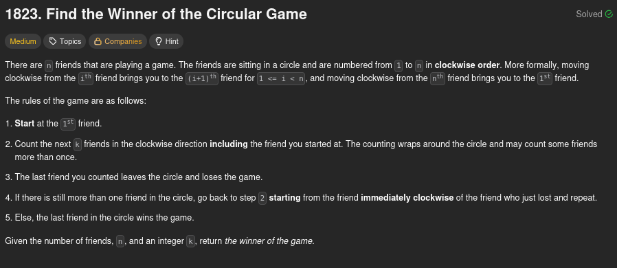
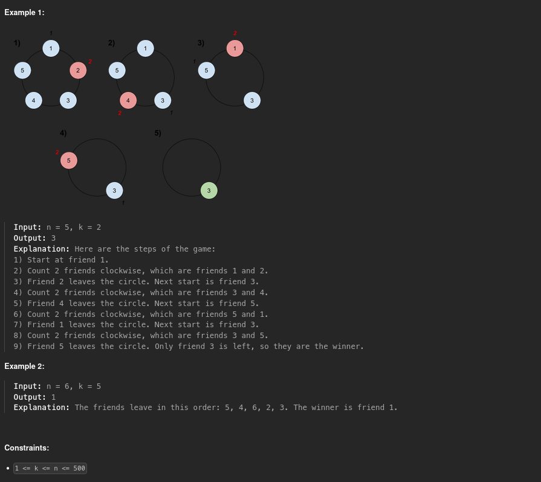

# 1823 - Find The Winner Of The Circular Game

## Problem statement




## First intuition: circular linked list

When I first saw the problem statement and the schema that was in the example I instantly thought about using [circular linked list](https://www.geeksforgeeks.org/dsa/circular-linked-list/), because it's the best way to represent the situation.

The algorithm is the following:

1. Initialize a circular linked list with `n` nodes and begin with the **nth** node
2. Initialize a `count` to `0` to know how many friends we've counted
3. Repeat the steps 4 and 5, as long as the current node value is different from the next node value
4. If `count` is equal to `k - 1`, our current's next node becomes our next's next node (`current.next = current.next.next`). We go to the next node and reinitialize `count` to `1`
5. Otherwise we just increment `count` and go to the next node
6. Return the current node value, it's the winner

With this method we have **k steps, n times**. So the time complexity is **O(kn)**.

Here is the code I submitted on LeetCode:

```python
class ListNode:
    def __init__(self, val=0, next=None):
self.val = val
self.next = next

class Solution:
    def findTheWinner(self, n: int, k: int) -> int:
        currFriend = self.createCircularLinkedList(n)
        count = 0
        while currFriend.val != currFriend.next.val:
            if count == k - 1:
                currFriend.next = currFriend.next.next
                currFriend = currFriend.next
                count = 1
            else: 
                count += 1
                currFriend = currFriend.next
        return currFriend.val
    def createCircularLinkedList(self, n: int) -> ListNode:
        head = ListNode(n, None)
        curr = head
        for i in range(n-1, 0, -1):
            next = curr
            curr = ListNode(i, next)
        head.next = curr
        return head
```

However, a time complexity of `O(kn)` is too slow, and it exceeds the time limit of the tests on Leetcode. Because of that I had to search for another method.

## Best solution: Find solution from n=1 game

To answer this problem in a faster way, we need to think differently. First, rather than representing our friends with nodes in a linked list we can use an array. For example, in a game with `n=5` we would have our table that looks like this `[1,2,3,4,5]`. Let's use `k=2` as in the example, we will eliminate friend number **2** first. So now we have our table like this: `[1,3,4,5]`, but because we have to begin with friend number 3 for the next round we can rotate our table to the left and get `[3,4,5,1]`. If you look at it you will notice that each friend's index changed in the following way

| Friend Number | Old Index           | New Index
| ------------- | ------------------- |----------------------
| 1             | 0                   | (0 - 2) % 5 = **3**
| 2             | 1                   | **Doesn't exist and anyway (1 - 2) % 5 = 4 -> IMPOSSIBLE in an array of size 4**
| 3             | 2                   | (0 - 2) % 5 = **0**
| 4             | 3                   | (0 - 2) % 5 = **1**
| 5             | 4                   | (0 - 2) % 5 = **2**

If we try to do the same thing with other cases we will always find the same relationship between the index of a friend in a game with `n` people and its index in a game with `n-1` people: `newIndex = (oldIndex - k) % n` and `oldIndex = (newIndex + k) % n`.

Now let's imagine we arrive at the end of the game, we would have `n=1`, `k=2` and our table would look like this `[?]`. We don't know who the winner is but we know how to get its `oldIndex2` (index when there were 2 people left) from its current index `0`: **oldIndex2 = (0 + 2) % 2 = 0**. And if we continue like that until the moment there were 5 people at the table, we would find who the winner of the game is:

* 1-people: index = 0
* 2-people: index = (0 + 2) % 2 = 0
* 3-people: index = (0 + 2) % 3 = 2
* 4-people: index = (2 + 2) % 4 = 0
* **5-people: index = (0 + 2) % 5 = 2**

So the winner of the game is the one at index `2`, **which is friend number 3**.

From this example you can deduce the following algorithm:

1. Initialize a `winnerIndex` at `0`
2. Initialize a counter `i` at `2`, because we already know the `winnerIndex` for one person
3. Compute `winnerIndex` for each value of `i` with the previous formula (`oldIndex = (newIndex + k) % n`) until `i > n`
4. Return `winnerIndex + 1` to get the friend that won the game

By doing this we only do `n` operations. It's faster than before. And indeed, the time complexity is **O(n)**. Also, the memory we use is constant, so the space complexity is **O(1)**, which is better than the circular linked list method with **O(n)** space complexity.

Here is the Python implementation:

```python
class Solution:
    def findTheWinner(self, n: int, k: int) -> int:
        winnerIndex = 0 # Winner index at table with 1 person
        for i in range(2, n + 1):
            winnerIndex = (winnerIndex + k) % i # Compute winner index at table with i people
        return winnerIndex + 1 # To convert index to the friend number
```

## Conclusion

I really struggled with this problem, to be honest. The way you have to approach it wasn't obvious to me, so I had to look at solutions. Then I tried to make my own understanding of what I've read and do it myself before validating the problem on LeetCode. It was really interesting though, because here the challenge is really about thinking logically and dividing the problem into sub-problems. It's different from some other problems where you have to use the right data structure or use a famous algorithm.