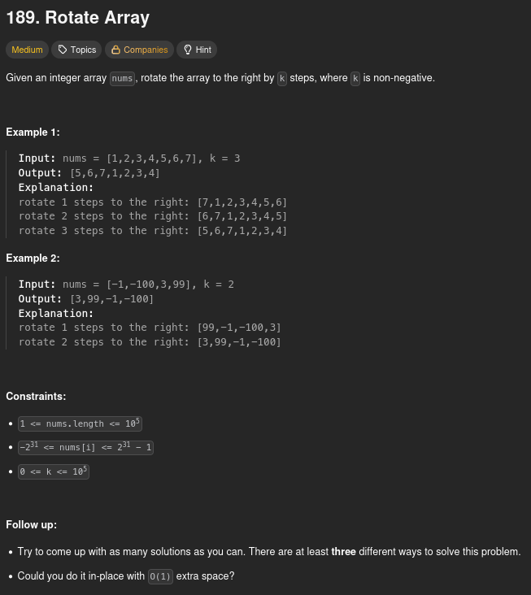

# 189. Rotate Array

## Problem statement



## First intuition: Use another array

When I first read the problem statement, one solution seemed obvious to me. But you'll see that it is not the best for memory usage optimization.

The solution is simple: to move an element `k` times to the right, we just have to increment its current index by `k`. To avoid some elements getting an index which is out of range, we can do: `(current_index + k) % n`, where `n` is the size of the array. But we can't assign the elements to their new index directly, because it would make other elements of the list disappear.

For example, let's say we have `nums = [1,2,3,4]` and `k = 2`. The new index of `nums[0]` should be **(0 + 2) % 4 = 2**. However, if we do `nums[2] = nums[0]` directly, we have `nums = [1,2,1,4]`, and the original value of `nums[2]` would be lost.

To avoid this behavior, we can use another array. Here is the algorithm I used:

1. Initialize a new array `rotated` with the same size as `nums`
2. Use an index `i` to go through each element of `nums`
3. For each value of `i`, assign `nums[i]` to `rotated[(i + k) % n]`
4. Go through each element of `rotated` and put it at the same index in `nums`

In this case, we have **2n steps**, so the time complexity is **O(n)**.

Here is the code I submitted on LeetCode:

```python
class Solution:
    def rotate(self, nums: list[int], k: int) -> None:
        nums_size = len(nums)
        rotated = [0 for i in range(nums_size)]
        for i in range(nums_size):
            rotated[(i + k) % nums_size] = nums[i]
        for i in range(nums_size):
            nums[i] = rotated[i]
```

However, the space complexity is **O(n)** because we used another array. We can improve this with another method.

## Improve space complexity: pop back, insert front

To get a better space complexity, we have to use only the `nums` array. One solution we can go for, dealing with this constraint, is also pretty intuitive.

Rotating an array to the right is, in fact, deleting its last element and adding it to the beginning. If we do this `k` times, we can answer the problem without using any extra space.

In this case, the space complexity is, indeed, **O(1)**, which is better than the previous method.

Here is the code that implements this algorithm:

```python
class Solution:
    def rotate(self, nums: list[int], k: int) -> None:
        while k > 0:
            el = nums.pop()
            nums.insert(0, el)
            k -= 1
```

However, the time complexity of inserting an element at the beginning of an array is **O(n)**. Because we are doing `k` insertions at the beginning of the list, the time complexity is **O(kn)**, which is very slow. On LeetCode, this will probably exceed the time limit of some tests. So we need a faster algorithm that doesn't use extra memory too.

## Best solution: multiple reverses

To resolve this problem in the best way, you can think of it as putting a sub-array before another. For example, if we want to rotate an array **2 times** to the right, it's just like taking the last 2 elements and putting them before the other elements of the list. But instead of taking away the last elements and inserting them at the front directly, which is too slow as we saw earlier, we will keep all the elements in the list and change their order.

Here is the algorithm:

1. Modify `k` so that `k = k % n`, where `n` is the size of the array. It will avoid getting out of range
2. Reverse the whole array
3. Reverse the sub-array from index `0` to index `k - 1`
4. Reverse the sub-array from index `k` to index `n - 1`

This way, we have a time complexity of **O(n)** and a space complexity of **O(1)**.

Here is the implementation:

```python
class Solution:
    def rotate(self, nums: list[int], k: int) -> None:
        k = k % len(nums)
        nums[:] = nums[::-1]
        nums[:k] = nums[:k][::-1]
        nums[k:] = nums[k:][::-1]
```

## Conclusion

Here we saw that we can answer a problem with multiple solutions. Sometimes you will have to think about speed, sometimes about space. Most of the time, the best solution is the one that is the best in both domains. Also, if you really think about it, the second method and the best one are not that different from each other, but you have to know the complexity of the actions you perform on a data structure (here, inserting at the beginning) to know that it slows your algorithm and think more about it to find a better way to do it.