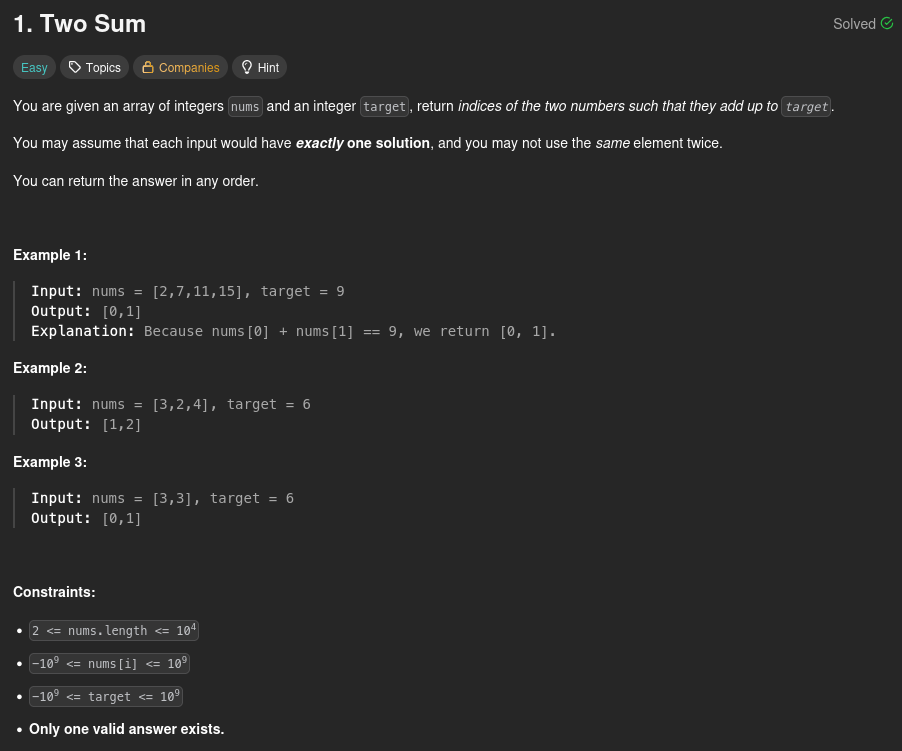

# 1. Two Sum

## Problem statement



## First intuition: Brute Force O(n²)

The **Two Sum** problem is the first problem that appears on LeetCode when you arrive on the platform. Obviously it's a beginner-level problem and because of that it also accepts beginner-level answers.

In my case, it was the first problem I solved on LeetCode. It was an opportunity to understand that, as a beginner, the first solution we have in mind is, most of the time, not the most optimized.

So when I first read the problem statement here is the algorithm I had in mind:
- We use an index `i` to iterate through the list
- For each `nums[i]` we are iterating through all the following entries of the list, with an index `j` and compute the sum each time
- If we have a sum which is equal to `target` we return `[i, j]`
- Otherwise we increment `i` and do the process again until we've reached the end of the list

In this case the number of operations for a list of size *n* is: n+(n-1)+(n-2)+...+1 = (n(n+1))/2 = **n²/2 + n/2**
So time complexity is **O(n²)** which is not ideal.

Here is the code I submitted on LeetCode:

```python
class Solution:
    def twoSum(self, nums: list[int], target: int) -> list[int]:
        nums_size = len(nums)
        for i in range(nums_size):
            for j in range(i + 1, nums_size):
                sum = nums[i] + nums[j]
                if sum == target:
                    return [i, j]
        return [] # Shouldn't happen
```

Somehow, it passed all the test cases. But we can solve this problem in a more efficient way.

## Best solution: Hash map O(n)

We can use a [map](https://www.geeksforgeeks.org/dsa/introduction-to-map-data-structure/). Each entry will have, as a key, an item of the list and, as a value, the index of the item in the list.

For example if we have `nums = [7, 8, -4]` we will have `map[7]` equal to `0`, `map[8]` equal to `1` and `map[-4]` equal to `2`

For a maximum efficiency we will fill this map while we are iterating through the list.

The algorithm is the following:
- We use an index `i` to iterate through the list
- We check if the map contains the key `target - nums[i]`
- If it's the case, we have a pair which the sum is equal to `target` and we return `[map[target - nums[i]], i]`
- Otherwise we store the current item in the map, with its index, we increment `i` and repeat the process until we reach the end of the list

We are iterating only one time through each item so here time complexity is **O(n)** which is far better.

Here is the code that implements this algorithm:

```python
class Solution:
    def twoSum(self, nums: list[int], target: int) -> list[int]:
        hashMap = {}
        for i in range(len(nums)):
            diff = target - nums[i]
            if diff in hashMap:
                return [hashMap[diff], i]
            hashMap[nums[i]] = i
        return [] # Shouldn't happen
```

## Conclusion

Here we've seen that, even for a simple problem, it's important to consider multiple options and see which one is the fastest. Also, having a good knowledge about data structures can be the key to finding an efficient solution to a problem (here, the hash map).
