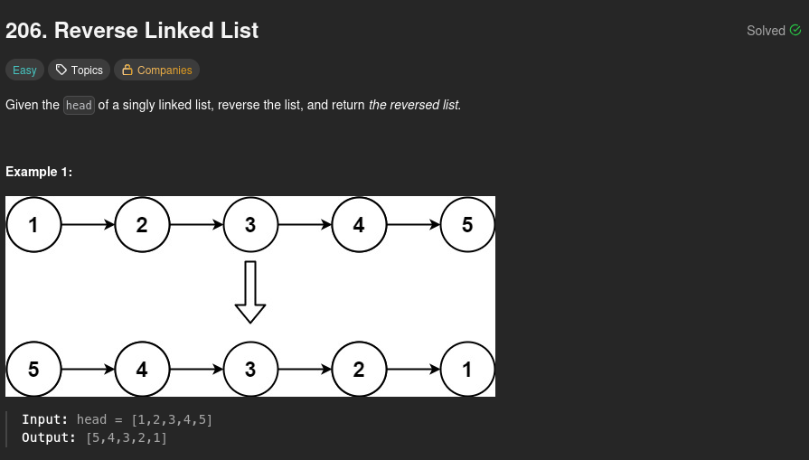
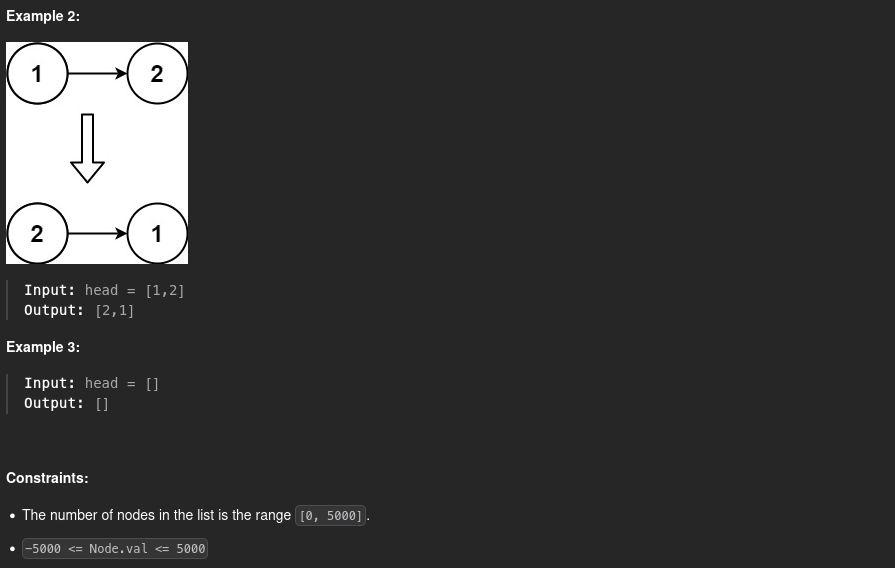

# 206. Reverse Linked List

## Problem statement




## Three pointers method

If you ever manipulate a linked list, you should already know the solution to this problem.

We can use the following algorithm:

1. Initialize a pointer `res` that points to `None`
2. Repeat steps 2 to 6 until `head` points to `None`
3. Initialize a pointer `tmp` that points to `head`
4. Make `head` point to its next element
5. The next element of `tmp` becomes `res`
6. Make `res` point to the same node as `tmp`
7. Return `res`, which is now the original linked list reversed

Here is an animation if you have trouble visualizing what is happening during the algorithm. Here **prev** is `res`, **curr** is `tmp`, and **next** is `head`:


This way, we go through the list only once, so the time complexity is **O(n)**.

Here is the code I submitted on LeetCode:

```python
# Definition for singly-linked list.
# class ListNode:
#     def __init__(self, val=0, next=None):
#         self.val = val
#         self.next = next
class Solution:
    def reverseList(self, head: ListNode | None) -> ListNode | None:
        res = None
        while head != None:
            tmp = head
            head = head.next
            tmp.next = res
            res = tmp
        return res
```

## Conclusion

This problem is one of the ones every beginner in programming encounters when discovering the linked list data structure. It is pretty simple but essential to understand how you can manipulate linked lists. The notion of a **pointer** for the nodes, for example, is very important (even more in languages like [C](https://en.wikipedia.org/wiki/C_(programming_language))).