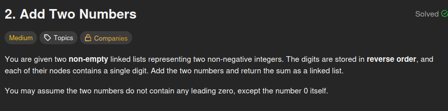
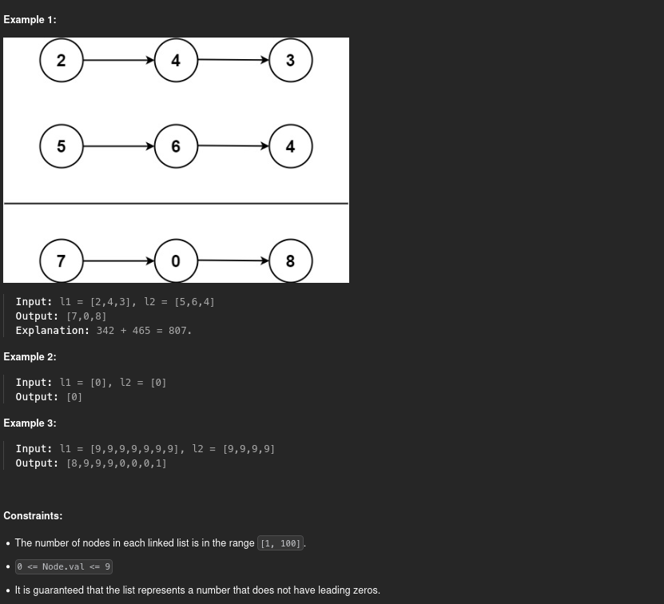

# 2. Add Two Numbers

## Problem statement




## Add node by node, carry usage, dummy node

One way of solving this problem is by using the classic method of doing sums. Indeed, all the digits are separated, each in one node. So we can add each digit of each number together and use a carry if the sum of those digits is greater than 9. We do this for every digit, by adding the carry value to the sum each time, until there are no more nodes in the two lists and the carry value is 0.

Also, we have to return a new linked list which represents the sum of the 2 numbers given in the arguments. This new list must have its most significant digit at the end of it. So we could add the sum of each digit at the beginning of the list each time (which is the classical way to add an element to a linked list) and then reverse the list before returning it. Or we can add by the end so that we don't have to do any other manipulation on our final list at the end.

Here is the detailed algorithm:

1. Initialize a new dummy list node, and use a variable to point to it so you keep track of the final list's beginning
2. Get the current node of the first list. If it's not `None`, then add its value to the total and make the list point to its next node
3. Get the current node of the second list. If it's not `None`, then add its value to the total and make the list point to its next node
4. If the carry is not 0, add its value to the total and reset it to 0
5. Create a new node with the unit digit of the total as a value and make it the next element of the current dummy list node
6. Make the current dummy list node point to its next element
7. The carry value becomes the tens digit of the total. If there is no tens digit, it's just 0
8. Reset the total value to 0
9. If both lists are empty and the carry value is 0, we can return our final list beginning that we stored in step 1. Otherwise, repeat the process from step 2

With this algorithm, we are going through each list only one time. For two lists with sizes **n1** and **n2**, the time complexity is **O(max(n1, n2))**.

Here is the code I submitted on LeetCode:

```python
#
# class ListNode:
#   def __init__(self, val=0, next=None):
#       self.val = val
#       self.next = next
#

class Solution:
    def addTwoNumbers(self, l1: ListNode, l2: ListNode) -> ListNode:
        extra = 0 # extra is the carry
        dummy = ListNode(0, None)
        res = dummy # we keep track of the beginning of our list
        while l1 != None or l2 != None or extra != 0:
            total = 0
            if l1 != None:
                total += l1.val
                l1 = l1.next
            if l2 != None:
                total += l2.val
                l2 = l2.next
            if extra != 0:
                total += extra
                extra = 0
            dummy.next = ListNode(total % 10, None)
            dummy = dummy.next # Our dummy variable points to the next node to continue adding nodes by the end of the list
            extra = total // 10
        return res.next # The head of the list we want is the next element of the dummy node we created at the beginning
```

## Conclusion

This problem is very basic but is important to understand how linked lists work. I think there are multiple ways of implementing this algorithm, but the way you manipulate and build your final linked list is the key to optimizing it.