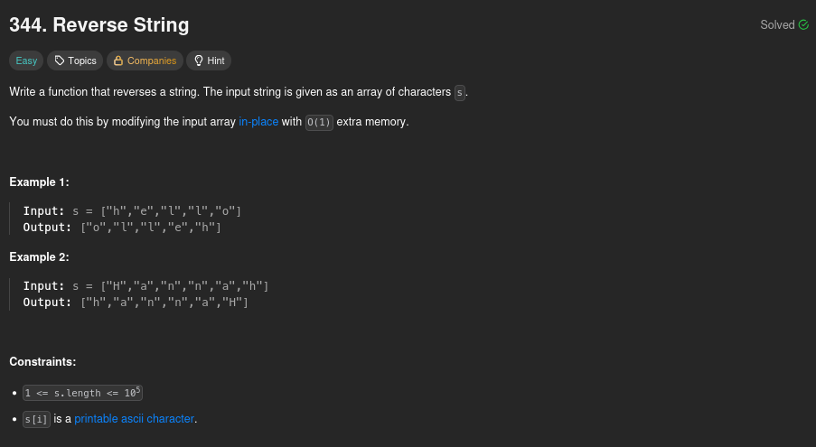

# 344. Reverse String

## Problem statement



## Two pointers method

Reversing a string is a well-known exercise for new developers. Especially in low-level languages like [C](https://en.wikipedia.org/wiki/C_(programming_language)), it is a good way to understand how to manipulate memory. For someone who has some experience with algorithms and programming, the solution is maybe not a mystery.

Here we need to reverse the string "in-place", which means that we can't use any additional memory. This way, we have a space complexity of **O(1)**. To do that, we can use the following algorithm:

1. Initialize an index `i` for the first item of the list and an index `j` for the last element.
2. Swap the element at index `i` with the element at index `j`.
3. Increment `i` and decrement `j`.
4. If `i` is greater than or equal to `j`, we have reached the middle of the list, so we can stop. Otherwise, we repeat the process from step 2.

In this case, we have **n/2 steps**, so the time complexity is **O(n)**.

Here is the code I submitted on LeetCode:

```python
class Solution:
    def reverseString(self, s: list[str]) -> None:
        i = 0
        j = len(s) - 1
        while i < j:
            tmp = s[i]
            s[i] = s[j]
            s[j] = tmp
            i += 1
            j -= 1
```

# Conclusion

This problem is very good for beginners, as it explores some fundamental concepts in programming, which are indexes and lists. It is also a good introduction to "in-place" algorithms and space complexity constraints.